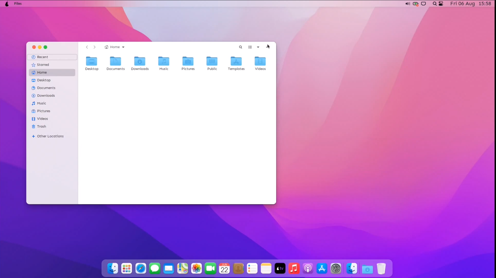
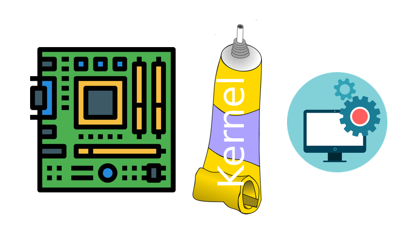

<!--hallo und willkommen zu meiner GFS, gleich ne frage: os?-->

---

<!-- 
Windows?
-->

---
<!-- paginate: false -->

<!-- 
macOs?
-->

---
<!--Ja mein thema heute ist Linux. -->
# Linux <!--fit-->

---

<!-- 
GNOME
-->

---

<!-- 
KDE Plasma
-->

---
<!--paginate: true-->
<!--Was ist mein ziel heute?: euch ein thema näher bringen wo die meisten von euch nicht viel von wissen.
Meine eigene erfahrung übermittlen: damit nicht die selben fehler-->
# Themen
- Was ist Linux?
- Geschichte
- Aufbau
- Distros
- Befehle
- Vor- und Nachteile
- Eigene Erfahrung
- Empfehlung

---
<!--Was ist Linux eigentlich?-->
# Was ist Linux? <!--fit-->
- Kernel, kein Betriebssystem <!--Kernel: Schnittstelle zwischen Hardware und Software-->
---
<!--Was ist überhaupt ein Kernel?-->

<!--Das wirft die frage auf: Wenn Linux nur das Klebstoff ist, was ist was ist eigentlich das betriebssystem was die meisten als linux kennen?-->

---

# Linux oder GNU/Linux?

- Namensuneinigkeit in der Community <!--GNU/Linux vs Linux-->
- wichtige Komponente von GNU <!--zb shell bash-->
<!--GNU ist ein Betriebssystem, Kernel schlecht => meistens Linux als kernel-->
<!--GNU komponente auch von Win und Mac benutzt-->
<!--GNU/Linux: korrekt, Linux: Einfacher-->
<!--Aber es gibt auch nicht den GNU/Linux OS, es gibt stattdessen mehrere GNU/Linux **basierte** Betriebssysteme die man Distribution oder Distro nennt-->

<!--Wie viele con euch benutzen Linux? und Android? Dann werdet ihr schokiert sein....-->
---
# Aber niemand benutzt Linux!!
- 96,3 % der Webserver <!--top eine Million-->
- 100% der Top 500 Supercomputer
- 83,1% der Smartphones
<!--in der schule ständig linux: fire tv, steam os, ANDROID, -->
 

---
<!--nachdem wir jetzt aso geklärt haben was, linux ist wie es benutzt wird, können wir uns die geschichte kurz angucken.-->

# Geschichte von Linux
- 1991 von Linus Torvalds entwickelt <!--Motivation: keine unterstützung für sein CPU, "nur als hobby, nichts großes"-->
<!--Name: Linus+Unix = Linux-->
- in 1990 kein GNU-Hurd <!-- das ist der Kernel was von GNU entwickelt wir. Außer hurd war alles andere schon fertig. so konnte man Linux und GNU zusammen als OS benutzen-->
- Große Gemeinschaft von Entwicklern und Benutzern
<!--auch scchon gesagt: große community: 1991: ca 9000 Codezeilen, Heute 27,8Mio-->
---

# Aufbau von Linux
- Modular <!--Manche Module vom distro: Pacman, manche serlber: Desktop, Displaymanager, Windowmanager-->
- Hierarchisches Dateisystem <!--Keine Drives, später mehr-->
- Desktop-Umgebung zur Interaktion mit dem Betriebssystem
<!--Desktop-Env = GUI. Bsp: Gnome, xfce, und der Beste: Plasma-->
- Paketmanager = App Store  <!--die ersten App stores-->

---
# Wichtigste Befehle

- Command-Line-Interface (CLI) zur interaktion
- Wichtige Befehle:
  - `ls`: Listet alle Dateien
  - `cd`: Wechselt das Verzeichnis
  - `sudo`: Führt Befehl als Administrator aus
<!--sehr wichting: cmd muss nicht unbedingt angefasst werden (GUI für fast alles), aber schneller und einfacher, ABER alles kann in cmd erledigt werden, natürlich noch viel mehr befehle-->
---

# Distros
<!--Distros oder distributions, sind Komplette betriebssysteme, basierend auf GNU/Linux.Die distro ersteller können frei wählen was für software dabei ist.zurzeit gibt es über 600 distros.-->
- Viele verschiedene Linux-Distributionen
- Beliebte Distros:
  - Ubuntu <!--Anfänger Distro, apt PM-->
  - Arch Linux <!--Distro für fortgeschrittene: nur ein shell. GUI muss seperat installiert werden, Pacman PM, ich benutze arch-->
  - Manjaro <!--basiert auf arch, einfachere installation, für alle-->
- Unterschiedliche Funktionen und Zielgruppen

---
# Vor- und Nachteile von Linux
### Vorteile

- Frei und open-source
- Sicher und stabil <!--Sicherer als alternativen: viren entwickeln lohnt sich weniger. Mehr entwickler suchen nach bugs-->
<!--Software installation sicherer, scheller, nicht auf random websiten nach .exes suchen, offizielle repos-->
- Flexibel
<!--viele einsetzungsbereiche: von handys über supercomputer alles möglich-->
- Große Gemeinschaft von Entwicklern und Benutzern <!--nette community hilft gerne-->
- Ressourceneffizient
<!--Live-testing vor installation-->
<!--installation auf usb möglich **usb zeigen**-->
<!--display nicht unbedingt benötigt, alles kann remote aus cmd gemacht werden-->

### Nachteile
<!--Desktops gehen mit multi-monitor setups schlechter um-->

- Umstieg 
- Software wechsel nötig <!--zb von MS Office auf OnlyOffice-->

---
# Für wen eignet sich Linux?

- Alle, die etwas Neues ausprobieren wollen
- Jeder, der Freiheit und Anpassbarkeit schätzt
<!--besonders für Entwickler und Programmierer-->
<!--Alternativen kennenlernen wollen-->
<!--für wen nicht?: Gamer oder MS Office, 
wenn bei alter routine bleiben, 
nichts nachschauen-->

# Welches Distro?
- Manjaro:
  - pacman <!--mehr software als alles andere-->
  - einfache Installation
  <!-- KDE-Desktop am besten anpassbar, selber nachschauen, eigene Meinung-->

---
## Anfängerfehler

- Distro nach aussehen
- Angst vor der Konsole
<!--
- egal welches distro, kann angepasst werden
  Desktops seperat installiert
- Viele unterscchiede wie zb Filesystem
- Einfach commands abschreiben
- Annahme dass es gleich it wie windows/mac
-->
---
<!--wie vielleicht manche von euch wissen benutze ich seit etwa einem halben jahr linux, deswegen möchte ich euch heute nicht nur theoretische sachen erzählen sondern, auch was meine erfahrungen mit diesem os sind. Ich habe die meisten größten distros und alle großen desktops ausprobiert. ->
# Persönliche Erfahrungen
- Viel schneller
- Manche Bugs <!--Selber schuld, falsch installiert-->
# Persönliche Erfahrung
- Viele distros ausprobiert:
  - Zorin OS <!--basiert auf ubuntu nur look-->
  - Ubuntu <!--sah schlecht aus-->
  - Arch Linux <!--finale entscheidung, viel gelernt-->
- GNOME Desktop <!--ohne anpassung: wie mac, zu wenig anpassbar-->
- KDE Plasma <!--ohne anpassung: wie win, sehr anpassbar-->
<!--interessante erfahrung, sieht besser aus-->
<!--fast alles funktioniert "out of the box"-->
---
# Fazit <!--oder: die letzten 15 min in einer min-->
- Linux: Kernel
- GNU/Linux: 
  - Frei und open-source Betriebssystem
  - Modular <!--auch anpassbar-->
- Positive Erfahrung, jedem zum Ausprobieren empfohlen

---
<!--das wars mit meiner präsentation, link zu mein github auf handout: quellen und source code. Bereit für alle fragen auch privat.-->
<!--Wer benutzt es, oder will es ausprobieren (nicht Android)-->

<!--Quellen:
https://wiki.archlinux.org/
https://en.wikipedia.org/wiki/GNU/Linux_naming_controversy
https://en.wikipedia.org/wiki/Linux
https://en.wikipedia.org/wiki/GNU
https://en.wikipedia.org/wiki/Linux_distribution
https://www.goodreads.com/quotes/1034-software-is-like-sex-it-s-better-when-it-s-free
https://www.linux.com/news/linux-in-2020-27-8-million-lines-of-code-in-the-kernel-1-3-million-in-systemd/
https://www.gnu.org
https://www.youtube.com/watch?v=fi-UTJGg4e8
https://pixabay.com/illustrations/adhesive-tube-paste-handcraft-4680410/
https://cdn-icons-png.flaticon.com/512/2729/2729156.png
https://freepngimg.com/thumb/categories/1868.png
https://truelist.co/blog/linux-statistics/
-->